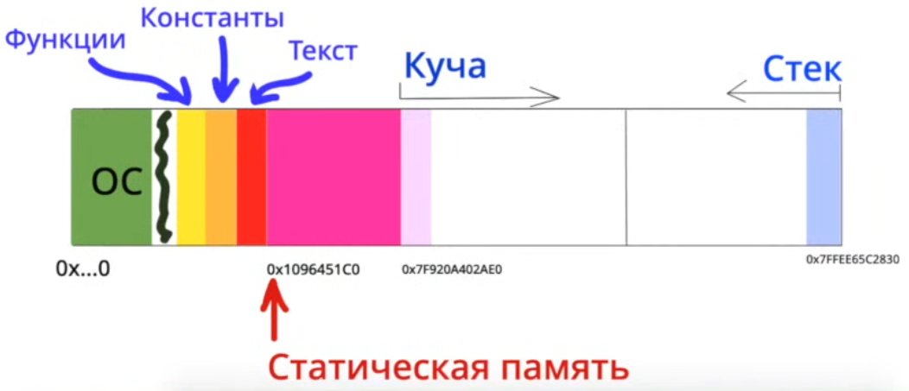

### Память компьютера с точки зрения программирования

1. Статическая память компьютера — функции, константы и текст. Статическое выделение памяти выполняется для статических и глобальных переменных. Память выделяется один раз (при запуске программы) и сохраняется на протяжении работы всей программы.
2. Стек — автоматическая память компьютера. Локальные переменные, фиксированные массивы. Автоматическое выделение памяти выполняется для параметров функции и локальных переменных. Память выделяется при входе в блок, в котором
находятся эти переменные, и удаляется при выходе из него.
3. Куча — динамическая память компьютера

#### Куча

В отличие от статического или автоматического выделения памяти, программа
самостоятельно отвечает за запрос и обратный возврат динамически выделенной
памяти.

Динамически выделенная память не имеет области видимости и остаётся до тех пор, пока не произойдёт её освобождение или пока программа не завершить своё выполнение. Нужно быть осторожным и не разыменовывать висячие или 0-е указатели!

Указатели, используемые для хранения динамически выделенных адресов памяти следуют правилам области видимости обычных переменнх.
