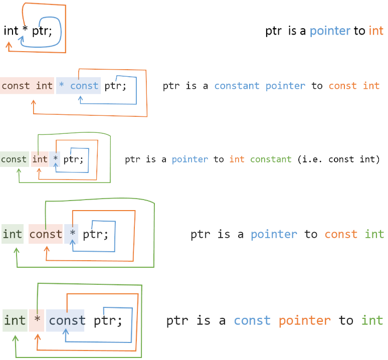

## Об ссылках и указателях

1. Ссылка - не объект, а только другое имя уже существующего объекта (псевдоним);
1. Поскольку ссылки не объекты, нельзя определить ссылку на ссылку;
1. Поскольку ссылки не объекты, у них нет адресов;
1. Типы ссылки и объекта, на который она ссылается, должны совпадать точно;
1. Ссылка может быть связана только с объектом, а не с литералом (Литерал - это элемент программы, который представляет значение);
1. Ссылки всегда следует инициализировать!
1. Ссылка не может быть изменена после её инициализации;
1. Ссылка не может быть нулевая, в отличии от указателей.

- Ссылка — это альтернативное имя для существующей переменной
- Ссылка обязательно должна быть инициализирована при объявлении и не может быть изменена, чтобы указывать на другой объект
- Ссылки не могут быть нулевыми, они всегда указывают на существующий объект
- Ссылки не могут указывать на массивы элементов
- Ссылки обычно используются в качестве аргументов функций для передачи данных по ссылке, что позволяет изменять исходные значения переменных
- Ссылка - это тот же указатель, который неявно разыменовывается при доступу к значению, на которое указывает
- Ссылки часто используются в качестве парпметров в функциях, когда мы хотим изменить значение аргумента или хотим избежать затратного копирования

1. Указатель - это настоящий объект!
1. Указатель не только хранит адрес другого значения (или nullptr) но и предоставляет доступ к хранимому значению через операцию разыменовывания
1. Указатель - это переменная, которая хранит только адрес другой переменной;
1. Указатель содержит только адрес, но между указателем и содержащимся в нём адресом нет жесткой связи;
1. Одному указателю можно присваивать разные значения;
1. Указатель всегда должен иметь тип, но тип указателя всегда должен соответствовать типу указываемой переменной;
1. Указатели в языке C++ по своей природе являются небезопасными;
1. С 64-битным исполняемым файлом указатель всегда будет занимать 64 бита (8 байт);
1. Указатель можно не инициализировать (но лучше так не делать!). Используйте nullptr для C++, если заранее не известно значение указателя ;
1. Указателю нельзя присвоить адрес памяти на прямую;

• Указатель — это переменная, которая содержит адрес ячейки памяти
• Указатели могут быть нулевыми (nullptr), что означает, что они не указывают ни на какую конкретную область памяти
• Указатели могут быть изменены для указания на другую область памяти
• Указатели могут указывать на массивы элементов
• Указатели могут использоваться для динамического выделения памяти с помощью оператора new и освобождения памяти с помощью оператора delete

### Константы и указатели

```const int *ptr = &value;``` - указатель на константное значение
> Неконстантный указатель можно перенаправить на любой другой адрес. С помощью указатель на неконстантное значение **можно изменить это же значение**, на которое он указывает

```int *const ptr = &value;``` - константный указатель на неконстантное значение
> это указатель, значение которого **не возможно изменить после инициализации**. Константный указатель всегда указывает на один и тот же адрес и этот адрес **не может быть изменён**

```const int *const ptr = &value;``` - константный указатель на некоснтантное значение

> Указатель на консантное значение обрабатывает значение как константное (даже если оно таковым не является) и это значение через указатель **изменить нельзя**



### Где используются указатели?

```char *ch = "Hello!";``` - способ создания символьных констант строк C-style — через указатель

```*word``` - получаем 1-й элемент массива

### Где используются ссылки?

```int&``` - доступ к перечислителям

```&var``` - возвращает адрес переменной

```&var``` - для инициализации указателя

```&ref = other.something.value``` - доступ к полям структуры

```void printIt(const int &a)``` - в качестве параметров функции, во избежание затратного с т.з. процессора копирования аргументов

## Учебные материалы по ссылкам и указателям

[Ссылки, указатели, константность](https://education.yandex.ru/handbook/cpp/article/references-pointers-const)

[С++. Указатели. Начало](https://www.youtube.com/watch?v=V8DGrIXlS4I)